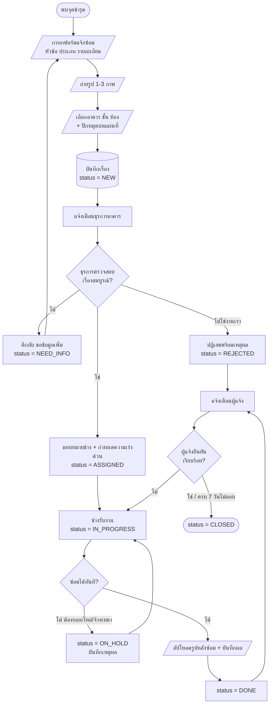
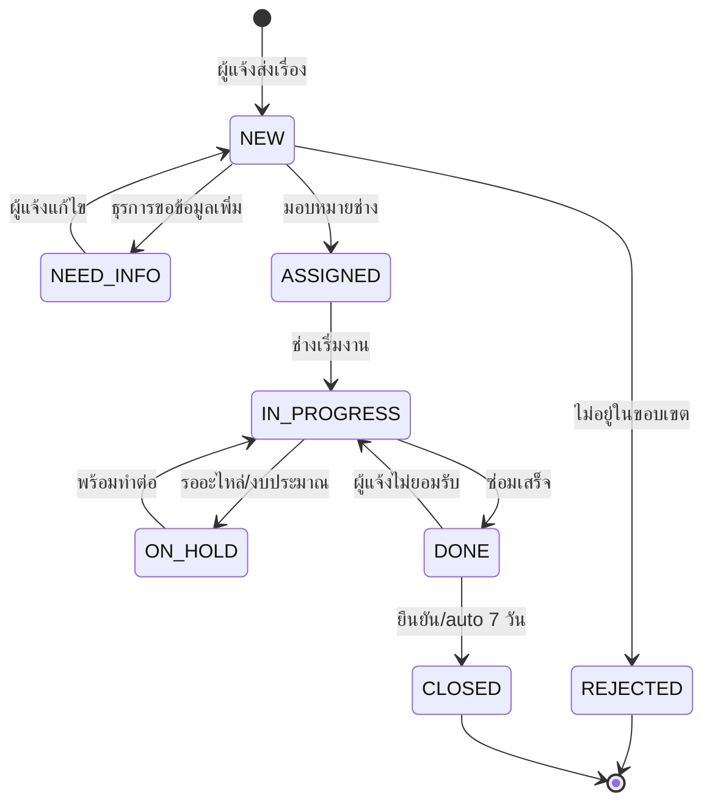
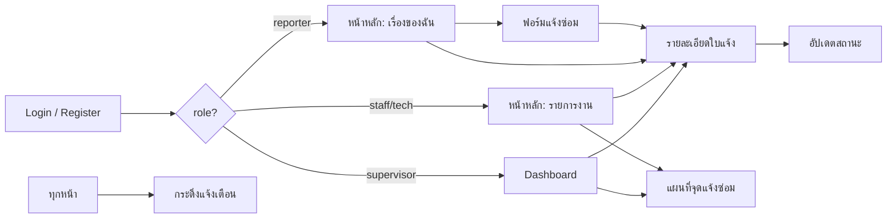

# Workshop 1 วัน — สร้างเว็บแอปด้วย Google Antigravity
## กรณีศึกษา: ระบบแจ้งซ่อมงานอาคารสถานที่ "FacilityCare"

> แนวคิดหลักของหลักสูตร: **"คิดให้จบก่อน แล้วค่อยให้ AI ลงมือ"**
> ผู้เรียนจะไม่พิมพ์คำสั่งลอย ๆ ให้ AI เดา แต่จะเปลี่ยนความคิดรวบยอด → Requirements → Flowchart → Spec → แล้วจึงให้ Agent พัฒนา ทดสอบ และ Deploy

---

## 1. ข้อมูลหลักสูตร

| หัวข้อ | รายละเอียด |
|---|---|
| ชื่อหลักสูตร | Agentic Web Development with Google Antigravity: ระบบแจ้งซ่อมอาคารสถานที่ |
| ระยะเวลา | 1 วัน (09.00–16.30 น. รวมพัก 1 ชม.) |
| กลุ่มเป้าหมาย | บุคลากรสายสนับสนุน/IT, อาจารย์, นักศึกษาป.ตรี–ป.โท ที่มีพื้นฐานคอมพิวเตอร์ทั่วไป (ไม่จำเป็นต้องเขียนโค้ดเป็น) |
| จำนวนที่เหมาะสม | 20–30 คน + ผู้ช่วยวิทยากร 2 คน |
| รูปแบบ | บรรยาย 30% : ปฏิบัติ 70% (ทำงานเดี่ยวบนเครื่องตัวเอง, ปรึกษาเป็นกลุ่ม 4–5 คน) |
| ผลผลิตของผู้เรียน | เว็บแอปแจ้งซ่อมที่ deploy ขึ้น Firebase Hosting ใช้งานได้จริง + repo บน GitHub + เอกสารออกแบบ (flowchart + ERD + spec) |

### ผลลัพธ์การเรียนรู้ (Learning Outcomes)

เมื่อจบการอบรม ผู้เรียนสามารถ

1. ติดตั้งและตั้งค่า Google Antigravity พร้อมเชื่อมต่อ GitHub ได้
2. แปลงปัญหาการทำงานจริงเป็น Requirements, User Story และ **Flowchart** ที่สื่อสารกับ AI ได้อย่างแม่นยำ
3. ใช้ AI ออกแบบโครงสร้างฐานข้อมูล (ERD / Firestore schema) และตรวจทานความถูกต้องด้วยตนเอง
4. สั่งงาน Agent ให้สร้างระบบ Login, ฟอร์มแจ้งซ่อม, อัปโหลดรูป, แผนที่ปักหมุด, Dashboard และระบบแจ้งเตือน
5. อ่านและวิจารณ์ **Artifacts** (Implementation Plan / Task List / Walkthrough) เพื่อควบคุมทิศทางของ Agent
6. ใช้ **Browser Agent** ทดสอบและตรวจรับงานหน้าเว็บโดยอัตโนมัติ
7. Deploy ระบบขึ้น Firebase Hosting และส่งมอบงาน

---

## 2. สิ่งที่ต้องเตรียมก่อนวันอบรม

### ผู้เรียนเตรียมมาเอง (ส่ง checklist ล่วงหน้า 1 สัปดาห์)

- [ ] โน้ตบุ๊ก Windows / macOS / Linux — RAM ≥ 8 GB (แนะนำ 16 GB), พื้นที่ว่าง ≥ 10 GB
- [ ] **บัญชี Google ส่วนตัว (Gmail)** — บัญชีองค์กรบางแห่งถูกล็อกไม่ให้ล็อกอิน Antigravity
- [ ] **บัญชี GitHub** (สมัครฟรี) + ยืนยันอีเมลแล้ว
- [ ] ติดตั้ง **Google Chrome และตั้งเป็นเบราว์เซอร์เริ่มต้น** (จำเป็นสำหรับ Browser Agent)
- [ ] ติดตั้ง **Node.js LTS (v20 ขึ้นไป)** และ **Git**
- [ ] ติดตั้ง **Google Antigravity** จาก `https://antigravity.google/download` (ทั้ง Antigravity และ Antigravity IDE)
- [ ] ทดลองล็อกอิน Antigravity ให้ผ่านมาก่อนวันอบรม

### ทีมงานเตรียม

- อินเทอร์เน็ตเสถียร (Agent ทำงานผ่านคลาวด์ตลอดเวลา) — ประเมิน 5–10 Mbps/คน
- ปลั๊กไฟเพียงพอ, จอโปรเจกเตอร์ 2 จอถ้าเป็นไปได้ (จอหนึ่งค้างที่ flowchart)
- Slide + ไฟล์นี้แจกเป็น PDF, และ repo ตัวอย่างสำรอง (เผื่อผู้เรียนตามไม่ทัน ให้ `git clone` จุดเช็กพอยต์ได้)
- **แผน B**: เตรียมโปรเจกต์สำเร็จรูปของแต่ละ checkpoint ไว้ใน branch `checkpoint-1` … `checkpoint-6`

---

## 3. ตารางเวลา

| เวลา | Session | หัวข้อ | ผลผลิต |
|---|---|---|---|
| 08.30–09.00 | — | ลงทะเบียน / ตรวจความพร้อมเครื่อง | เครื่องพร้อม |
| 09.00–09.30 | **S0** | Agentic Development คืออะไร + โจทย์ FacilityCare | เข้าใจภาพรวม |
| 09.30–10.15 | **S1** | ติดตั้ง & ตั้งค่า Antigravity + เชื่อม GitHub | Project + repo ว่าง |
| 10.15–10.30 | ☕ | พักเบรก | |
| 10.30–11.20 | **S2** | **คิดก่อนโค้ด: Requirements → User Story → Flowchart** | `docs/flow.md` |
| 11.20–12.00 | **S3** | AI ออกแบบฐานข้อมูล + เขียน `SPEC.md` | ERD + spec |
| 12.00–13.00 | 🍽 | พักกลางวัน | |
| 13.00–13.50 | **S4** | Scaffold โปรเจกต์ + ระบบ Login (Firebase Auth) | ล็อกอินได้ |
| 13.50–14.40 | **S5** | ฟอร์มแจ้งซ่อม + อัปโหลดรูป + แผนที่ปักหมุด | แจ้งซ่อมได้ |
| 14.40–14.55 | ☕ | พักเบรก | |
| 14.55–15.35 | **S6** | Dashboard + ระบบแจ้งเตือน | Dashboard ใช้งานได้ |
| 15.35–16.10 | **S7** | Browser Agent ตรวจงาน + Deploy ขึ้น Hosting | URL จริง |
| 16.10–16.30 | **S8** | นำเสนอ 60 วินาที / ถอดบทเรียน / ต่อยอด | ใบประกาศ |

---

## 4. รายละเอียดแต่ละ Session

---

### S0 — Agentic Development และโจทย์ (09.00–09.30)

**บรรยาย (15 นาที)**

- ยุคของเครื่องมือ: Autocomplete → Chat assistant → **Agent ที่วางแผน ลงมือ และตรวจสอบงานเองได้**
- Antigravity คืออะไร: แพลตฟอร์มพัฒนาแบบ agent-first ของ Google ใช้ได้ฟรีในช่วง preview บน Mac/Windows/Linux รองรับหลายโมเดล (Gemini 3 Pro/Flash, Claude, GPT-OSS)
- องค์ประกอบ 4 ส่วน:
  | ส่วน | ใช้ทำอะไร | ใช้ในเวิร์กช็อปนี้ |
  |---|---|---|
  | **Antigravity** (แอปหลัก) | ศูนย์บัญชาการ สั่ง Agent หลายตัวขนาน ตั้ง Scheduled Task | ✅ ใช้เป็นหลัก |
  | **Antigravity IDE** | IDE เต็มรูปแบบ (fork ของ VS Code) + Agent panel | ✅ ใช้ดู/แก้โค้ด |
  | **Antigravity CLI** | สั่ง Agent จาก terminal | ⛔️ ไม่ครอบคลุม |
  | **Antigravity SDK** | เขียน Python สร้าง agent เอง | ⛔️ ไม่ครอบคลุม |
- แนวคิดสำคัญ 5 คำ: **Project · Conversation · Artifact · Browser Agent · Skill**

**เปิดโจทย์ (10 นาที)** — เล่าให้เห็นภาพจริง

> งานอาคารสถานที่ของหน่วยงานรับแจ้งซ่อมผ่าน LINE กลุ่มและกระดาษ
> ปัญหา: หาเรื่องเก่าไม่เจอ, ไม่รู้ว่าเรื่องไหนค้าง, ไม่รู้ว่าจุดชำรุดอยู่ตรงไหนกันแน่ ("ห้องน้ำชั้น 3 ตึกไหน?"),
> ไม่มีรูปประกอบ, ผู้แจ้งไม่รู้สถานะ, สิ้นปีสรุปสถิติไม่ได้

**เป้าหมายของวันนี้** — สร้าง **FacilityCare**: ระบบแจ้งซ่อมที่มี
1. แจ้งเรื่องพร้อมรูป + ปักหมุดตำแหน่งบนแผนที่
2. เจ้าหน้าที่รับเรื่อง มอบหมายช่าง อัปเดตสถานะ
3. ผู้แจ้งติดตามสถานะและได้รับแจ้งเตือน
4. Dashboard สรุปภาพรวมสำหรับผู้บริหาร

**กติกาสำคัญของวัน (เขียนติดผนัง)**
> 🚫 ห้ามสั่ง Agent ว่า "สร้างระบบแจ้งซ่อมให้หน่อย"
> ✅ ต้องมี flowchart และ spec ก่อนเสมอ — AI เก่งเรื่อง "ทำอย่างไร" แต่ **เราต้องเป็นคนตอบว่า "ทำอะไร และทำไม"**

---

### S1 — ติดตั้ง ตั้งค่า และเชื่อม GitHub (09.30–10.15)

#### 1.1 ติดตั้งและล็อกอิน (10 นาที)
- ดาวน์โหลดจาก `antigravity.google/download` → ติดตั้ง → ล็อกอินด้วย Google → ยอมรับ Security & Data Use → เลือกธีม → เลือก plugin (ข้ามได้)
- ติดตั้ง **Antigravity IDE** เพิ่ม (ไอคอนพื้นดำ) — จะเห็น 2 ไอคอนใน dock

#### 1.2 สร้าง Project (10 นาที)

Project ใน Antigravity = **ชุดโฟลเดอร์ + สิทธิ์ + เครื่องมือ** ที่กำหนดขอบเขตให้ Agent (ไม่ใช่แค่โฟลเดอร์เดียว จะรวม frontend + backend repo ก็ได้)

```bash
mkdir -p ~/antigravity-projects/facility-care
```

`Select Project → New Project → Add Folder` → เลือกโฟลเดอร์ → ตั้งชื่อ `facility-care` → Create

#### 1.3 ตั้งค่า Project Settings (10 นาที) — **สอนให้เข้าใจ ไม่ใช่กด Next ผ่าน**

| ค่า | ความหมาย | แนะนำในห้องอบรม |
|---|---|---|
| Security Preset | Agent ต้องขออนุญาตก่อนรันคำสั่ง terminal / แก้ไฟล์หรือไม่ | **ให้รีวิวก่อน** ในช่วงเช้า (เพื่อให้เห็นว่า Agent ทำอะไร) แล้วค่อยผ่อนช่วงบ่าย |
| Agent Behaviour | ให้ Agent ลงมือตาม plan เลย หรือรอเรารีวิวก่อน | **รอรีวิว** — หัวใจของวันนี้คือการอ่าน Implementation Plan |
| Local Permissions | path / URL ที่อนุญาตหรือบล็อก | ปล่อย default |
| MCP Tools | เลือกว่า MCP server ไหนใช้ได้ในโปรเจกต์นี้ | เปิดเฉพาะที่ใช้ |

> 💡 **จุดสอนสำคัญ**: ความปลอดภัยคือการ "ให้สิทธิ์เท่าที่จำเป็น" — โปรเจกต์งานจริงที่มีข้อมูลส่วนบุคคลต้องตั้งค่าให้เข้ม

#### 1.4 เชื่อมต่อ GitHub (15 นาที)

**วิธีที่ 1 — ให้ Agent ทำให้ (แนะนำ)**

Prompt:
```
สร้าง Git repository ในโฟลเดอร์นี้ ตั้งค่า .gitignore สำหรับโปรเจกต์ Node/Vite
(ต้องมี node_modules, .env, .firebase, dist)
สร้าง README.md อธิบายว่าโปรเจกต์นี้คือระบบแจ้งซ่อมอาคารสถานที่
แล้ว commit แรกด้วยข้อความ "chore: initial project setup"
จากนั้นบอกขั้นตอนที่ฉันต้องทำเองเพื่อ push ขึ้น GitHub
```

**วิธีที่ 2 — ทำเอง (สำรอง)**
```bash
gh auth login              # หรือสร้าง repo ผ่านเว็บ
gh repo create facility-care --public --source=. --push
```

**ตั้งค่า GitHub MCP (ถ้าเวลาเหลือ / สาธิตหน้าห้อง)**
`Settings → Customizations → Add MCP +` → เลือก GitHub → ใส่ token
เมื่อเชื่อมแล้วสั่งได้เช่น *"เปิด issue ใน repo facility-care สำหรับงานที่ยังไม่เสร็จทั้งหมด"*

> ✅ **Checkpoint 1**: มี Project ใน Antigravity + repo บน GitHub ที่มี commit แรก

---

### S2 — คิดก่อนโค้ด: Requirements → Flowchart (10.30–11.20) ⭐ **หัวใจของหลักสูตร**

> ช่วงนี้ **ปิดหน้าจอ Agent** 20 นาทีแรก ใช้กระดาษ/ไวท์บอร์ดก่อน

#### 2.1 ขั้นที่ 1 — ตีโจทย์ด้วย 5W1H (10 นาที, ทำเป็นกลุ่ม)

| คำถาม | คำตอบของ FacilityCare |
|---|---|
| **Who** ใครใช้ | ผู้แจ้ง (บุคลากร/นักศึกษา), ธุรการอาคาร, ช่างเทคนิค, หัวหน้างาน/ผู้บริหาร |
| **What** ทำอะไร | แจ้ง–รับเรื่อง–มอบหมาย–ซ่อม–ปิดงาน–สรุปผล |
| **When** เมื่อไร | ทันทีที่พบปัญหา, ติดตามได้ตลอดเวลา, สรุปรายเดือน |
| **Where** ที่ไหน | มือถือเป็นหลัก (ผู้แจ้งยืนอยู่หน้าจุดชำรุด) → **ต้อง responsive** |
| **Why** ทำไม | ลดเรื่องตกหล่น, รู้ตำแหน่งชัดเจน, มีหลักฐานภาพ, วัดผลได้ |
| **How** อย่างไร | เว็บแอป + Firebase + แผนที่ |

#### 2.2 ขั้นที่ 2 — Actor & User Story (10 นาที)

รูปแบบ: **ในฐานะ \<ใคร\> ฉันต้องการ \<ทำอะไร\> เพื่อ \<ได้ประโยชน์อะไร\>**

| # | Actor | User Story | Priority |
|---|---|---|---|
| US-01 | ผู้แจ้ง | แจ้งจุดชำรุดพร้อมรูปและตำแหน่งบนแผนที่ | Must |
| US-02 | ผู้แจ้ง | ดูสถานะเรื่องที่ตนแจ้งไว้ | Must |
| US-03 | ธุรการ | เห็นเรื่องใหม่ทั้งหมดและมอบหมายช่าง | Must |
| US-04 | ช่าง | ดูงานที่ได้รับมอบหมาย + อัปเดตสถานะพร้อมรูปหลังซ่อม | Must |
| US-05 | ทุกคน | ได้รับแจ้งเตือนเมื่อสถานะเปลี่ยน | Should |
| US-06 | หัวหน้างาน | Dashboard สรุปจำนวน/ประเภท/เวลาเฉลี่ย/แผนที่จุดชำรุด | Should |
| US-07 | ผู้ดูแล | จัดการผู้ใช้ อาคาร และประเภทงาน | Could |
| US-08 | ผู้แจ้ง | ให้คะแนนความพึงพอใจหลังปิดงาน | Won't (เฟสถัดไป) |

> 💡 **สอน MoSCoW**: ในเวิร์กช็อป 1 วัน เราทำ **Must ทั้งหมด + Should เท่าที่ทัน** — การกล้าตัด scope คือทักษะที่สำคัญกว่าการเขียนโค้ด

#### 2.3 ขั้นที่ 3 — เขียน Flowchart 4 ระดับ (20 นาที)

**สอนให้เห็นว่า flowchart ไม่ได้มีแบบเดียว** แต่ละแบบตอบคำถามคนละอย่าง

**(ก) Process Flow — ภาพรวมกระบวนการ (ตอบว่า "งานเดินอย่างไร")**



**(ข) State Diagram — วงจรชีวิตของใบแจ้งซ่อม (ตอบว่า "สถานะมีอะไรบ้าง เปลี่ยนไปไหนได้")**

> นี่คือสิ่งที่ AI ต้องการมากที่สุด เพราะมันแปลตรงเป็น enum + logic การอนุญาต



**(ค) Swimlane — ใครทำอะไร (ตอบว่า "สิทธิ์ของแต่ละ role คืออะไร")**

| ขั้นตอน | ผู้แจ้ง | ธุรการ | ช่าง | หัวหน้างาน |
|---|:---:|:---:|:---:|:---:|
| สร้างใบแจ้ง | ✅ | ✅ | ✅ | ✅ |
| ดูใบแจ้งทั้งหมด | เฉพาะของตน | ✅ | ที่ได้รับมอบหมาย | ✅ |
| มอบหมายช่าง | ⛔️ | ✅ | ⛔️ | ✅ |
| เปลี่ยนสถานะเป็น IN_PROGRESS/DONE | ⛔️ | ⛔️ | ✅ | ✅ |
| ปิดงาน (CLOSED) | ✅ (ของตน) | ✅ | ⛔️ | ✅ |
| ดู Dashboard | ⛔️ | ✅ | ⛔️ | ✅ |
| จัดการผู้ใช้/อาคาร | ⛔️ | ⛔️ | ⛔️ | ✅ (admin) |

**(ง) Screen Flow — ผังหน้าจอ (ตอบว่า "แอปมีกี่หน้า ไปกันอย่างไร")**



#### 2.4 ขั้นที่ 4 — ให้ AI ช่วยหาช่องโหว่ของ Flowchart (10 นาที)

**ตอนนี้จึงเปิด Antigravity** และใช้ AI เป็น "ผู้ตรวจ" ไม่ใช่ "ผู้คิดแทน"

Prompt:
```
ฉันออกแบบกระบวนการของระบบแจ้งซ่อมอาคารสถานที่ไว้ตาม flowchart ด้านล่าง
บทบาทของคุณคือ Business Analyst ที่ช่างสงสัย

[วาง mermaid flowchart + state diagram + ตาราง swimlane]

ช่วยทำ 3 อย่าง:
1. หา edge case ที่ฉันยังไม่ได้ครอบคลุม (เช่น เรื่องซ้ำ, ผู้แจ้งลาออก, ช่างลาป่วย, เรื่องเร่งด่วนกลางคืน)
2. ชี้จุดที่ business rule ยังกำกวมและตั้งคำถามกลับมาให้ฉันตัดสินใจ อย่าเดาแทนฉัน
3. ตรวจว่า state transition ครบถ้วนหรือไม่ มี state ไหนที่เข้าไปแล้วออกไม่ได้

ยังไม่ต้องเขียนโค้ดใด ๆ
```

**กิจกรรม**: ผู้เรียนตอบคำถามที่ AI ถามกลับ แล้วปรับ flowchart → บันทึกเป็น `docs/flow.md`

> ✅ **Checkpoint 2**: ไฟล์ `docs/flow.md` มี flowchart 4 ระดับที่ผ่านการตรวจแล้ว
> 💡 **จุดสอน**: สังเกตว่าเราใช้ AI 2 แบบต่างกัน — *"ช่วยคิด"* กับ *"ช่วยตรวจ"* แบบหลังปลอดภัยกว่ามาก

---

### S3 — AI ออกแบบฐานข้อมูล และเขียน SPEC.md (11.20–12.00)

#### 3.1 สอนหลักการก่อน (5 นาที)

- Entity = คำนามในโจทย์ (ใบแจ้ง, ผู้ใช้, อาคาร, ประเภทงาน, ประวัติการอัปเดต)
- Relationship = ความสัมพันธ์ (ผู้ใช้ 1 คน → แจ้งได้หลายใบ)
- **NoSQL (Firestore) ต่างจาก SQL**: ออกแบบตาม "หน้าจอที่ต้องแสดง" ไม่ใช่ตาม normalization — ยอม denormalize ได้ (เก็บ `reporterName` ซ้ำในใบแจ้ง เพื่อไม่ต้อง join)

#### 3.2 Prompt ออกแบบฐานข้อมูล (15 นาที)

```
จาก flowchart และ user story ใน @docs/flow.md
ช่วยออกแบบโครงสร้างข้อมูลสำหรับ Cloud Firestore

ข้อกำหนด:
- ระบุ collection, field, ชนิดข้อมูล, ค่าที่เป็นไปได้ (enum), field ที่ต้องมี index
- อธิบายเหตุผลที่เลือก denormalize ตรงไหนบ้าง โดยอ้างอิงจากหน้าจอที่ต้องใช้
- เขียน ERD เป็น mermaid erDiagram
- ระบุรูปแบบเลขที่ใบแจ้ง เช่น FC-2569-0001 และวิธีสร้างให้ไม่ชนกัน
- เสนอ Firestore Security Rules เบื้องต้นตามตาราง swimlane ที่ให้ไว้
- เตือนฉันด้วยถ้ามี field ไหนเป็นข้อมูลส่วนบุคคลที่ควรระวังตาม PDPA

ผลลัพธ์ให้เขียนลงไฟล์ docs/data-model.md ยังไม่ต้องเขียนโค้ดแอป
```

**โครงสร้างเป้าหมาย (วิทยากรเตรียมไว้เทียบ)**

```
users/{uid}
  displayName, email, phone, role: reporter|staff|technician|supervisor|admin,
  department, createdAt

buildings/{buildingId}
  code, name, lat, lng, floors: number

tickets/{ticketId}
  ticketNo: "FC-2569-0001"
  title, description
  category: electrical|plumbing|aircon|structure|network|furniture|other
  priority: low|normal|high|urgent
  status: NEW|NEED_INFO|ASSIGNED|IN_PROGRESS|ON_HOLD|DONE|CLOSED|REJECTED
  buildingId, buildingName, floor, room
  location: { lat, lng }          # ปักหมุด
  photos: [ {url, path, uploadedAt} ]
  reporterId, reporterName, reporterPhone
  assigneeId, assigneeName
  createdAt, updatedAt, assignedAt, doneAt, closedAt
  dueAt                           # คำนวณจาก SLA ตาม priority

tickets/{ticketId}/updates/{updateId}
  fromStatus, toStatus, note, photos[], byUid, byName, createdAt

notifications/{notiId}
  toUid, ticketId, ticketNo, type, message, read: bool, createdAt
```

**Composite index ที่ต้องมี** (ให้ผู้เรียนสังเกตว่า AI บอกครบหรือไม่)
`tickets: reporterId + createdAt desc` · `tickets: status + createdAt desc` · `tickets: assigneeId + status`

#### 3.3 รวมทุกอย่างเป็น SPEC.md (15 นาที) ⭐

**นี่คือเอกสารที่จะกลายเป็น "สัญญา" ระหว่างเรากับ Agent ตลอดช่วงบ่าย**

```
อ่าน @docs/flow.md และ @docs/data-model.md
แล้วสรุปเป็นไฟล์ SPEC.md ฉบับเดียวที่ใช้เป็นแหล่งอ้างอิงหลักของโปรเจกต์ ประกอบด้วย

1. ภาพรวมระบบและวัตถุประสงค์
2. Actor และสิทธิ์ (ตาราง)
3. รายการ User Story พร้อม acceptance criteria แบบ Given-When-Then
4. โครงสร้างข้อมูล
5. รายการหน้าจอ และสิ่งที่ต้องมีในแต่ละหน้า
6. Tech stack ที่กำหนด:
   - Vite + React 18 + JavaScript + Tailwind CSS
   - Firebase: Authentication (Email/Password + Google), Firestore, Storage, Hosting
   - แผนที่: Leaflet + react-leaflet + OpenStreetMap tiles
   - กราฟ: Recharts
   - รองรับมือถือเป็นหลัก (mobile-first)
   - UI ภาษาไทย, วันที่แบบไทย
7. สิ่งที่ "ไม่ทำ" ในเวอร์ชันนี้ (out of scope)

เขียนให้กระชับ ใช้ bullet และตาราง อย่าใส่โค้ด
```

> ✅ **Checkpoint 3**: มี `docs/flow.md`, `docs/data-model.md`, `SPEC.md` — commit ขึ้น GitHub
> 💡 **จุดสอน**: ตอนนี้ผู้เรียน "เขียนโปรแกรม" ไปแล้ว 40% ทั้งที่ยังไม่มีโค้ดสักบรรทัด

---

### S4 — Scaffold โปรเจกต์ + ระบบ Login (13.00–13.50)

#### 4.1 เตรียม Firebase (15 นาที) — ทำคู่ขนาน วิทยากรฉายจอ

1. `console.firebase.google.com` → Add project → ชื่อ `facility-care-<ชื่อคุณ>` → ปิด Analytics
2. **Authentication** → Get started → เปิด **Email/Password** และ **Google**
3. **Firestore Database** → Create → เลือก region `asia-southeast1` → เริ่มที่ **test mode** (จะเปลี่ยน rules ทีหลัง)
4. **Storage** → Get started → region เดียวกัน
5. Project settings → Your apps → **Web (</>)** → คัดลอก firebaseConfig เก็บไว้

> ⚠️ **จุดสอนเรื่องความปลอดภัย**: firebaseConfig ไม่ใช่ความลับ (มันอยู่ใน client อยู่แล้ว) — **สิ่งที่ปกป้องข้อมูลจริง ๆ คือ Security Rules** ห้ามคิดว่าซ่อน config แล้วจะปลอดภัย

#### 4.2 Scaffold ด้วย Agent (15 นาที)

```
อ่าน @SPEC.md ให้ครบก่อน

งานที่ 1: สร้างโครงโปรเจกต์
- Vite + React + JavaScript + Tailwind CSS
- ติดตั้ง firebase, react-router-dom, react-leaflet, leaflet, recharts, date-fns, lucide-react
- โครงสร้างโฟลเดอร์: src/pages, src/components, src/services, src/hooks, src/contexts, src/utils
- ใส่ฟอนต์ไทยที่อ่านง่าย (Noto Sans Thai หรือ IBM Plex Sans Thai)
- สร้าง src/services/firebase.js ที่อ่านค่าจาก .env (VITE_FIREBASE_*)
- สร้างไฟล์ .env.example และเพิ่ม .env ใน .gitignore
- ทำหน้า placeholder ทุกหน้าตามผัง screen flow พร้อม routing

อย่าเพิ่งทำ business logic ทำแค่โครงและ routing ให้รันได้ก่อน
เสร็จแล้วรัน dev server และบอกฉันว่าต้องใส่อะไรใน .env
```

**ระหว่างรอ — สอนอ่าน Artifacts (นี่คือช่วงที่ต้องหยุดสาธิตจริงจัง)**

| Artifact | คืออะไร | ต้องดูอะไร |
|---|---|---|
| **Implementation Plan** | แผนสถาปัตยกรรม/การแก้ไข ก่อนลงมือ | **อ่านให้ละเอียดที่สุด** ถ้าแผนผิด โค้ดผิดหมด — comment แก้ได้ก่อนกด Proceed |
| **Task List** | รายการงานย่อยที่ tick ทีละข้อ | ใช้ติดตามความคืบหน้า |
| **Walkthrough** | สรุปสิ่งที่ทำและวิธีทดสอบ | ใช้ตรวจรับงานและเขียน commit message |
| **Screenshots** | ภาพหน้าจอก่อน/หลัง | หลักฐานว่า UI เปลี่ยนจริง |
| **Code diffs** | ความต่างของโค้ด | รีวิวแบบ PR |

เปิดดูผ่าน **Auxiliary Pane** (มุมขวาบน)

> 💡 **จุดสอน**: Artifact แก้ปัญหา "trust gap" — เมื่อก่อน AI บอกว่า "แก้ให้แล้ว" เราต้องไปไล่โค้ดเอง ตอนนี้มันต้องแสดงหลักฐาน
> **แบบฝึกหัดสั้น**: ให้ผู้เรียนพิมพ์ comment ลงใน Implementation Plan อย่างน้อย 1 ข้อ เช่น *"ขอให้ใช้ react-router v6 แบบ createBrowserRouter"* แล้วดูว่า Agent ปรับตาม

#### 4.3 ระบบ Login (20 นาที)

```
งานที่ 2: ระบบยืนยันตัวตนตาม SPEC ข้อ 2 และ 3

- หน้า /login: อีเมล+รหัสผ่าน และปุ่ม "เข้าสู่ระบบด้วย Google"
- หน้า /register: อีเมล ชื่อ-สกุล เบอร์โทร หน่วยงาน รหัสผ่าน
  เมื่อสมัครสำเร็จให้สร้าง document ใน users/{uid} โดย role เริ่มต้น = "reporter"
- AuthContext + useAuth hook เก็บ user + profile (role) จาก Firestore
- ProtectedRoute: ยังไม่ล็อกอิน → เด้งไป /login
- RoleRoute: เข้าหน้าที่ไม่มีสิทธิ์ → แสดงหน้า 403 ที่สุภาพ
- หลังล็อกอิน redirect ตาม role ตามผัง screen flow
- ข้อความ error เป็นภาษาไทยที่คนทั่วไปเข้าใจ
  (เช่น auth/invalid-credential → "อีเมลหรือรหัสผ่านไม่ถูกต้อง")
- มี loading state ทุกปุ่ม กันกดซ้ำ
```

**ทดสอบ**: สมัคร 2 บัญชี แล้วเข้า Firebase Console เปลี่ยน `role` ของบัญชีที่สองเป็น `staff` ด้วยมือ → ล็อกอินใหม่ ต้องเห็นหน้าต่างกัน

> ✅ **Checkpoint 4**: ล็อกอิน/สมัครได้ และเห็นหน้าตาม role

---

### S5 — ฟอร์มแจ้งซ่อม + อัปโหลดรูป + แผนที่ (13.50–14.40)

#### 5.1 ฟอร์มแจ้งซ่อมและอัปโหลดรูป (25 นาที)

```
งานที่ 3: หน้าแจ้งซ่อม /tickets/new ตาม US-01

ฟอร์ม:
- หัวข้อ (บังคับ, 5-100 ตัวอักษร)
- ประเภทงาน (dropdown ตาม enum ใน SPEC พร้อมไอคอน)
- ความเร่งด่วน (low/normal/high/urgent) อธิบายสั้น ๆ ว่าแต่ละระดับหมายถึงอะไร
- รายละเอียด (textarea, บังคับ)
- อาคาร (dropdown จาก collection buildings), ชั้น, ห้อง

อัปโหลดรูป:
- เลือกได้ 1-3 รูป, รองรับถ่ายจากกล้องมือถือ (capture="environment")
- แสดง preview thumbnail และลบทีละรูปได้
- **ย่อรูปฝั่ง client ก่อนอัปโหลด**: ด้านยาวสุดไม่เกิน 1600px, JPEG quality 0.8
  (สำคัญมาก เพราะรูปจากมือถือใหญ่ 5-8 MB)
- อัปโหลดขึ้น Storage ที่ path: tickets/{ticketId}/{timestamp}_{index}.jpg
- แสดง progress bar ระหว่างอัปโหลด และปุ่มยกเลิก
- ถ้าอัปโหลดล้มเหลว ต้องไม่ทำให้ข้อมูลใบแจ้งหาย

เมื่อบันทึก: สร้าง ticket ตาม data model, สร้าง ticketNo อัตโนมัติ, status = NEW
คำนวณ dueAt จาก priority (urgent 4 ชม., high 1 วัน, normal 3 วัน, low 7 วัน)
```

> ⚠️ **จุดที่ Agent มักพลาด — ให้ผู้เรียนตรวจเอง**: อัปโหลดรูปก่อนหรือหลังสร้าง ticket? ถ้าอัปโหลดก่อนแล้วผู้ใช้ปิดหน้าไป จะเกิด "ไฟล์กำพร้า" ใน Storage — ลองถาม Agent ว่าจัดการเรื่องนี้อย่างไร

#### 5.2 แผนที่ปักหมุด (25 นาที) 🗺️

```
งานที่ 4: เพิ่มการระบุตำแหน่งด้วยแผนที่ในฟอร์มแจ้งซ่อม

ใช้ Leaflet + react-leaflet + OpenStreetMap tiles
- สร้าง component <LocationPicker value={{lat,lng}} onChange={...} />
- ค่าเริ่มต้น: ศูนย์กลางแผนที่ที่พิกัดของอาคารที่เลือกใน dropdown
- ปุ่ม "ใช้ตำแหน่งปัจจุบัน" เรียก navigator.geolocation
  ต้องจัดการกรณีผู้ใช้ปฏิเสธสิทธิ์ และกรณีความแม่นยำต่ำ (แสดงวงรัศมี accuracy)
- ผู้ใช้ลากหมุด หรือคลิกบนแผนที่เพื่อย้ายหมุดได้
- แสดงพิกัดเป็นตัวเลข 6 ตำแหน่งใต้แผนที่
- แก้ปัญหา marker icon ของ Leaflet ที่หายเมื่อ build ด้วย Vite
- ตรวจสอบให้แผนที่ทำงานได้ดีบนหน้าจอมือถือ (ไม่แย่ง scroll กับหน้าเว็บ)

หมายเหตุ: ถ้าจะเปลี่ยนไปใช้ MapLibre GL JS ในอนาคต
ให้ออกแบบ component นี้ให้เปลี่ยน implementation ได้โดยไม่กระทบส่วนอื่น
```

**สอนเสริม 5 นาที — Leaflet vs MapLibre GL**

| | Leaflet | MapLibre GL JS |
|---|---|---|
| Render | Raster tiles (DOM/Canvas) | Vector tiles (WebGL) |
| ขนาด | เล็ก เบา | ใหญ่กว่า |
| จุดเด่น | ง่ายมาก ปลั๊กอินเยอะ | หมุน/เอียงแผนที่, styling ยืดหยุ่น, จุดจำนวนมากลื่นกว่า |
| เหมาะกับ | งานปักหมุดทั่วไป ✅ **เลือกใช้ในวันนี้** | Dashboard เชิงพื้นที่, heatmap, 3D อาคาร |

> ✅ **Checkpoint 5**: แจ้งซ่อมได้จริง พร้อมรูปและหมุดตำแหน่ง — ตรวจใน Firebase Console ว่าข้อมูลเข้าครบ

---

### S6 — Dashboard และระบบแจ้งเตือน (14.55–15.35)

#### 6.1 รายการงาน + อัปเดตสถานะ (15 นาที)

```
งานที่ 5: หน้ารายการงานและรายละเอียด

/tickets — รายการ:
- Filter: สถานะ, ประเภท, อาคาร, ความเร่งด่วน, ช่วงวันที่, ค้นหาข้อความ
- แสดงตามสิทธิ์ใน swimlane (reporter เห็นเฉพาะของตน / technician เห็นที่มอบหมายให้ตน)
- Card แสดง: เลขที่, หัวข้อ, badge สถานะ (สีตามระดับ), ความเร่งด่วน, อาคาร-ชั้น, เวลา, รูปแรก
- ไฮไลต์ใบที่เลย dueAt ด้วยสีแดงและป้าย "เกินกำหนด"

/tickets/:id — รายละเอียด:
- ข้อมูลครบ + แกลเลอรีรูป (คลิกขยาย) + แผนที่แสดงหมุด (อ่านอย่างเดียว)
- Timeline ประวัติจาก subcollection updates
- ปุ่มเปลี่ยนสถานะ **แสดงเฉพาะ transition ที่อนุญาตตาม state diagram ใน SPEC และตาม role เท่านั้น**
- ทุกครั้งที่เปลี่ยนสถานะ ต้องบันทึกลง updates และอัปเดต timestamp ที่เกี่ยวข้อง
- ธุรการ/หัวหน้างานมอบหมายช่างได้ (dropdown จาก users ที่ role = technician)
```

#### 6.2 ระบบแจ้งเตือน (10 นาที)

```
งานที่ 6: ระบบแจ้งเตือนภายในแอป

- เมื่อสถานะใบแจ้งเปลี่ยน ให้สร้าง document ใน notifications
  ส่งถึง: ผู้แจ้ง (ทุกครั้ง) และช่างที่รับผิดชอบ (เมื่อถูกมอบหมาย)
- ไอคอนกระดิ่งบน navbar พร้อมตัวเลขจำนวนที่ยังไม่อ่าน
  ใช้ Firestore onSnapshot เพื่อให้อัปเดตแบบ real-time
- Dropdown แสดง 10 รายการล่าสุด คลิกแล้วไปหน้าใบแจ้งและ mark เป็นอ่านแล้ว
- หน้า /notifications แสดงทั้งหมด พร้อมปุ่ม "อ่านทั้งหมด"
```

**สอนต่อยอด (พูดอย่างเดียว ไม่ต้องทำ)**
- **อีเมล**: Firebase Extension "Trigger Email from Firestore" — ตั้งค่าไม่กี่นาที
- **Web Push**: Firebase Cloud Messaging + service worker
- **LINE**: ปัจจุบันต้องใช้ **LINE Messaging API** (LINE Notify ปิดบริการไปแล้วเมื่อ มี.ค. 2568) — ต้องมี Cloud Function เป็นตัวกลาง
- ⚠️ **ข้อควรระวัง**: การเขียน notification จาก client ทำได้ในเวิร์กช็อป แต่ระบบจริงควรย้ายไป **Cloud Functions** (`onDocumentUpdated`) เพื่อไม่ให้ client ปลอมแปลงการแจ้งเตือนได้

#### 6.3 Dashboard (15 นาที)

```
งานที่ 7: หน้า /dashboard สำหรับ supervisor/admin

การ์ดตัวเลข: เรื่องทั้งหมด, ค้างดำเนินการ, เสร็จเดือนนี้, เกินกำหนด SLA,
เวลาเฉลี่ยตั้งแต่รับแจ้งจนปิดงาน (ชั่วโมง)

กราฟด้วย Recharts:
- Bar: จำนวนเรื่องแยกตามประเภทงาน
- Pie/Donut: สัดส่วนตามสถานะ
- Line: แนวโน้มรายวันย้อนหลัง 30 วัน
- Horizontal bar: 5 อาคารที่แจ้งซ่อมมากที่สุด

แผนที่ภาพรวม:
- Leaflet แสดงหมุดของทุกใบแจ้ง สีตามสถานะ
- ใช้ marker cluster เมื่อหมุดหนาแน่น
- คลิกหมุด → popup ย่อ → ลิงก์ไปหน้ารายละเอียด

ปุ่ม Export CSV ตาม filter ปัจจุบัน (ให้ encoding รองรับภาษาไทยใน Excel)
ทุกส่วนต้องแสดงผลได้ดีบนจอมือถือ
```

> ✅ **Checkpoint 6**: Dashboard แสดงข้อมูลจริงจาก Firestore

---

### S7 — Browser Agent ตรวจงาน + Deploy (15.35–16.10)

#### 7.1 Browser Agent (15 นาที) ⭐ **ไฮไลต์ที่คนตื่นเต้นที่สุด**

Browser Agent เปิด Chrome จริง คลิกจริง กรอกฟอร์มจริง แล้วรายงานผลกลับพร้อมภาพ/วิดีโอ
(ต้องตั้ง Chrome เป็นเบราว์เซอร์เริ่มต้น)

**สาธิต 1 — ทดสอบ end-to-end**
```
/browser เปิด http://localhost:5173 แล้วทดสอบ flow การแจ้งซ่อมทั้งหมด:
1. สมัครสมาชิกใหม่ด้วยอีเมล test-<random>@example.com
2. เข้าสู่ระบบ
3. แจ้งซ่อมเรื่องใหม่: หัวข้อ "หลอดไฟชั้น 3 ดับ" ประเภทไฟฟ้า ความเร่งด่วน high
   เลือกอาคารใดก็ได้ ปักหมุดบนแผนที่
4. บันทึก แล้วตรวจว่าไปโผล่ในรายการ "เรื่องของฉัน" จริง
5. เปิดหน้ารายละเอียดและตรวจว่าข้อมูลครบถ้วน

รายงานผลเป็น artifact พร้อม screenshot ทุกขั้นตอน
ถ้าเจอ error ให้บอกว่าเกิดที่ไหนและสาเหตุน่าจะคืออะไร แต่ยังไม่ต้องแก้
```

**สาธิต 2 — ตรวจ responsive และ accessibility**
```
/browser ทดสอบเว็บที่ localhost:5173 ที่ความกว้าง 390px (iPhone) และ 1440px
ตรวจว่ามีเนื้อหาล้นขอบ ปุ่มเล็กเกินกด หรือข้อความทับกันหรือไม่
ตรวจ contrast ของสีตัวอักษรกับพื้นหลังตามเกณฑ์ WCAG AA
สรุปเป็นรายการปัญหาเรียงตามความรุนแรง พร้อม screenshot ประกอบ
```

จากนั้นสั่ง `แก้ปัญหา 3 ข้อแรกที่พบ แล้วทดสอบซ้ำด้วย browser เพื่อยืนยันว่าแก้ได้จริง`
→ **นี่คือลูป plan → execute → verify ที่เป็นหัวใจของ agentic development**

#### 7.2 Security Rules และ Deploy (20 นาที)

```
งานที่ 8: เตรียมขึ้นระบบจริง

1. เขียน firestore.rules ที่บังคับสิทธิ์ตามตาราง swimlane ใน @SPEC.md
   - อ่าน role จาก users/{uid} ด้วย get()
   - reporter อ่านได้เฉพาะ ticket ที่ reporterId == uid
   - ห้าม client แก้ status ข้ามลำดับที่ state diagram ไม่อนุญาต
   - ห้ามแก้ createdAt, ticketNo, reporterId หลังสร้างแล้ว
2. เขียน storage.rules: อัปโหลดได้เฉพาะผู้ล็อกอิน, ไฟล์ ≤ 5MB, เฉพาะ image/*
3. สร้าง firestore.indexes.json ตาม query ที่ใช้จริง
4. อธิบายให้ฉันฟังทีละบรรทัดว่า rule แต่ละข้อป้องกันอะไร
5. รัน build และแก้ warning ที่เกิดขึ้น
6. บอกขั้นตอน deploy ขึ้น Firebase Hosting ทีละคำสั่ง
```

```bash
npm install -g firebase-tools
firebase login
firebase init      # เลือก Hosting + Firestore + Storage
                   # public directory = dist,  SPA = Yes,  ไม่ต้องให้ overwrite index.html
npm run build
firebase deploy
```

**ทดสอบของจริง**: ให้ทุกคนเปิด URL ที่ได้ (`https://xxx.web.app`) **บนมือถือตัวเอง** แล้วลองแจ้งซ่อมจริงในห้องอบรม (เช่น "ปลั๊กไฟห้องประชุมหลวม") → เห็นข้อมูลขึ้น Dashboard บนจอโปรเจกเตอร์ทันที 🎉

**ปิดท้าย — push ขึ้น GitHub**
```
commit งานทั้งหมดด้วยข้อความที่สื่อความหมาย แยกเป็นหลาย commit ตามฟีเจอร์
อัปเดต README.md ให้มี: ภาพหน้าจอ, วิธีติดตั้ง, ตัวแปร .env ที่ต้องใช้, URL ที่ deploy แล้ว
แล้ว push ขึ้น GitHub
```

> ✅ **Checkpoint 7**: URL ใช้งานได้จริง + repo สมบูรณ์

---

### S8 — นำเสนอและถอดบทเรียน (16.10–16.30)

- **Lightning demo 60 วินาที/คน** (สุ่ม 5–6 คน) เปิด URL จริงบนจอ
- **ถอดบทเรียนร่วมกัน** — คำถามชวนคุย:
  1. ตอนไหนที่ Agent เข้าใจผิด? ย้อนดูสิว่าเป็นเพราะ spec เราไม่ชัดหรือเปล่า
  2. flowchart ที่วาดตอนเช้า ช่วยประหยัดเวลาตอนบ่ายอย่างไรบ้าง
  3. ถ้าไม่มี Artifact ให้อ่าน เราจะรู้ได้อย่างไรว่า Agent ทำถูก
- **สิ่งที่ยังขาดก่อนใช้งานจริง** (สำคัญมาก อย่าให้ผู้เรียนกลับไปด้วยความเข้าใจผิด):
  - PDPA: ข้อตกลงการใช้ข้อมูล, การลบข้อมูล, การเก็บรูปที่อาจติดใบหน้าคน
  - ย้าย business logic สำคัญไป Cloud Functions
  - ระบบสำรองข้อมูล, การทดสอบอัตโนมัติ, การเชื่อมกับระบบบุคลากรขององค์กร
  - การประเมินต้นทุน Firebase เมื่อผู้ใช้มาก
- **ต่อยอด**: Skills, Scheduled Tasks (เช่น สรุปเรื่องค้างส่งทุกเช้า 8 โมง), MCP servers, Antigravity CLI

---

## 5. ภาคผนวก

### ก. Prompt Pattern ที่สอนในหลักสูตรนี้

| Pattern | รูปแบบ | ใช้เมื่อ |
|---|---|---|
| **Role + Task + Constraint + Output** | "คุณคือ BA / ช่วยหา edge case / อย่าเดาแทนฉัน / ตอบเป็นตาราง" | ทุกครั้ง |
| **อ้างอิงไฟล์ด้วย @** | `อ่าน @SPEC.md แล้ว…` | ให้ Agent ยึด spec ไม่หลุดบริบท |
| **Stop point** | "ยังไม่ต้องเขียนโค้ด" / "ทำแค่โครงก่อน" | กัน Agent วิ่งเลยธง |
| **Verify loop** | "แก้แล้วทดสอบด้วย browser เพื่อยืนยัน" | ตรวจรับงาน |
| **Explain back** | "อธิบายทีละบรรทัดว่า rule นี้ป้องกันอะไร" | เรียนรู้จากโค้ดที่ AI เขียน |
| **Ask me back** | "ถ้ามีจุดกำกวม ให้ถามกลับ อย่าเดา" | ลดการสมมติผิด |

### ข. Rubric ประเมินผลงาน (100 คะแนน)

| เกณฑ์ | คะแนน |
|---|---|
| เอกสารออกแบบ: flowchart 4 ระดับ + ERD + SPEC ครบและสอดคล้องกัน | 25 |
| ระบบใช้งานได้: login, แจ้งซ่อม, รูป, แผนที่, สถานะ | 30 |
| Dashboard และการแจ้งเตือน | 15 |
| Deploy สำเร็จ + repo มี README ที่คนอื่นทำตามได้ | 15 |
| คุณภาพการควบคุม Agent (มีการ comment ใน Implementation Plan, มีผลทดสอบจาก Browser Agent) | 15 |

### ค. Troubleshooting ที่เจอบ่อย

| อาการ | สาเหตุ/วิธีแก้ |
|---|---|
| `/browser` ไม่ทำงาน | Chrome ไม่ใช่เบราว์เซอร์เริ่มต้น |
| ล็อกอิน Antigravity ไม่ผ่าน | ใช้บัญชี Google ขององค์กรที่ถูกจำกัด → ใช้ Gmail ส่วนตัว |
| หมุด Leaflet หายหลัง build | ปัญหา path ของ marker icon กับ Vite → import icon เข้ามาโดยตรง |
| แผนที่เป็นสีเทาว่างเปล่า | container ไม่มีความสูง → กำหนด `height` ให้ชัดเจน |
| อัปโหลดรูปค้าง | CORS ของ Storage / ยังไม่ได้เปิดใช้ Storage / rules บล็อก |
| Firestore query error พร้อมลิงก์ | ต้องสร้าง composite index → คลิกลิงก์ใน error ได้เลย |
| Agent วนแก้ไม่จบ | หยุด แล้วเริ่ม conversation ใหม่ อ้างอิง `@SPEC.md` และระบุปัญหาให้แคบลง |
| แอปช้าเมื่อข้อมูลเยอะ | ไม่ได้ใส่ `limit()` ใน query → เพิ่ม pagination |

### ง. ลิงก์อ้างอิง

- Google Antigravity — https://antigravity.google/
- เอกสาร — https://antigravity.google/docs/home
- Codelab เริ่มต้น — https://codelabs.developers.google.com/getting-started-google-antigravity
- Firebase Console — https://console.firebase.google.com
- Leaflet — https://leafletjs.com · react-leaflet — https://react-leaflet.js.org
- MapLibre GL JS — https://maplibre.org

---

## 6. หมายเหตุสำหรับวิทยากร

1. **อย่ารีบข้าม S2** — ถ้าเวลาไม่พอ ให้ตัดฟีเจอร์ในช่วงบ่าย (เช่น ตัดระบบแจ้งเตือน) แต่ห้ามตัดช่วงออกแบบ flowchart เพราะเป็นสาระสำคัญของหลักสูตร
2. **เตรียม branch สำรองทุก checkpoint** — คนที่ตกขบวนให้ `git clone` มาต่อได้ ไม่ให้ใครนั่งดูเฉย ๆ
3. **เน้นย้ำตลอดวันว่า Agent ผิดพลาดได้** ผู้เรียนต้องกล้าอ่าน กล้าแย้ง กล้าสั่งให้ทำใหม่
4. **ปรับกรณีศึกษาได้ตามผู้เรียน** — โครงสร้างเดียวกันนี้ใช้กับ ระบบยืม-คืนครุภัณฑ์, ระบบจองห้องประชุม, ระบบรับเรื่องร้องเรียน หรือระบบสำรวจภาคสนาม ได้ทันที เพียงเปลี่ยน entity และ state diagram
5. **ถ้ากลุ่มผู้เรียนเป็นสายภูมิศาสตร์/GIS** ขยาย S5–S6 เป็นครึ่งวัน แล้วเพิ่ม: การใช้ MapLibre + vector tiles, การซ้อน layer ผังอาคาร, การวิเคราะห์เชิงพื้นที่หาจุดที่ชำรุดซ้ำซาก และการ export เป็น GeoJSON
